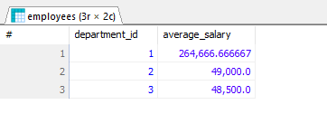

# Lab Report 02

_Course:_ Database Management System Sessional (CSEC-322) 

**Submitted By:** 
Fatema Tabassum Diba 
ID: 2222081029 
Batch: 57A Day 
Semester: Fall-2024 

## Create and Use Database

CREATE DATABASE Labreport2;
USE Labreport2;

## Create Tables

CREATE TABLE employees (
employee_id INT PRIMARY KEY,
name VARCHAR(50),
salary DECIMAL(10, 2),
department_id INT,
department_name VARCHAR(20),
phone VARCHAR(20)
);

CREATE TABLE customers (
customer_id INT PRIMARY KEY,
name VARCHAR(50),
phone VARCHAR(20)
);

CREATE TABLE orders (
order_id INT PRIMARY KEY,
customer_id INT,
order_amount DECIMAL(10, 2),
FOREIGN KEY (customer_id) REFERENCES customers(customer_id)
);

CREATE TABLE products (
product_id INT PRIMARY KEY,
product_name VARCHAR(50),
category_id INT
);

## Insert Sample Data

INSERT INTO employees (employee_id, name, salary, department_id,department_name, phone)
VALUES
(1, 'Mahmud Rashid', 75000.00, 1, 'Business', '01923845512'),
(2, 'Shazid Abrar', 32000.00, 2,'Fashion', '01723845556'),
(3, 'Abrar Agmain', 70000.00, 1,'Business', '0185553456'),
(4, 'Diana Tabassum', 58000.00, 3,'Textile', '01923845513'),
(5, 'Sabbir Ahmed', 45000.00, 2,'Fashion', '01823845556'),
(6, 'Shimul Ahmed', 47000.00, 1,'Business', '01623845512'),
(7, 'Khadiza Tabassum', 44000.00, 3,'Textile', '01723845512'),
(8, 'Fatema Tabassum', 39000.00, 2,'Fashion', '01538455561'),
(9, 'Himel Hassan', 63000.00, 1,'Business', '01623845556'),
(10, 'Sabbir Hossain', 61000.00, 3,'Textile', '01523845556'),
(11, 'Lotif Muhammed', 68000.00, 2,'Fashion', '01823845512'),
(12, 'Humayra Tabassum', 71000.00, 1,'Business', '01623845500');

INSERT INTO customers (customer_id, name, phone)
VALUES
(1, 'Khaled Hossain', '01623845500'),
(2, 'Zahir Rayhan', '0175553456'),
(3, 'Fariha Sabrin', '0185553456'),
(4, 'Tahsin Hena', '0185553414'),
(5, 'Abrar Shazid', '0195553400');

INSERT INTO orders (order_id, customer_id, order_amount) VALUES
(1, 1, 250.00),
(2, 2, 500.00),
(3, 3, 150.00),
(4, 4, 300.00),
(5, 1, 100.00),
(6, 2, 450.00);

INSERT INTO products (product_id, product_name, category_id) VALUES
(1, 'Laptop', 1),
(2, 'Dell Mouse', 2),
(3, 'iPhone 16pro', 3),
(4, 'iPhone 12max', 3),
(5, 'Tablet', 4),
(6, 'Monitor', 5),
(7, 'Keyboard', 6),
(8, 'MacBook', 1),
(9, 'Tech Mouse', 2),
(10, 'Lg Mouse', 2),
(11, 'ipad', 4);

## Q1: Retrieve all employees with a salary greater than 50,000.

SELECT \* FROM employees WHERE salary>50000;

### Output of Q1

## Q2: Retrieve all employees whose names start with '%Tabassum'.

SELECT \* FROM employees WHERE name LIKE '%Tabassum';

### Output of Q2

## Q3: Group employees by department_id and calculate the average salary.

SELECT department_name,department_id, AVG(salary) AS average_salary FROM employees GROUP BY department_id;

### Output of Q3

## Q4: Retrieve departments with an average salary greater than 50,000.

SELECT department_name,department_id, AVG(salary) AS average_salary FROM employees
GROUP BY department_id HAVING AVG(salary) > 50000;

### Output of Q4

## Q5: Retrieve all orders placed by customers with IDs 1, 2, and 3.

SELECT \* FROM orders WHERE customer_id IN (1, 2, 3);

### Output of Q5

## Q6: Retrieve all products that are not in categories 1, 2, and 3

SELECT \* FROM products WHERE category_id NOT IN (1, 2, 3);

### Output of Q6

## Q7: Retrieve all employees who work in a department with more than or equal 4 employees.

SELECT \* FROM employees WHERE department_id IN ( SELECT department_id FROM employees GROUP BY department_id
HAVING COUNT(employee_id) >= 4);

### Output of Q7

